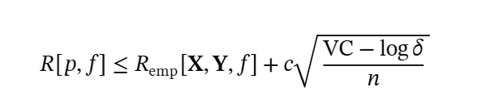
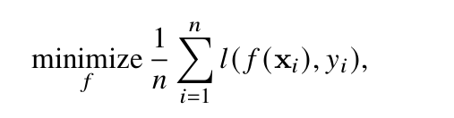
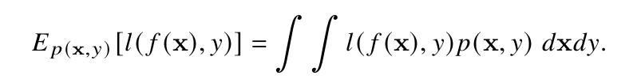
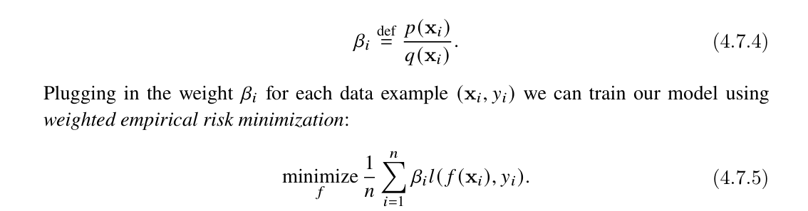
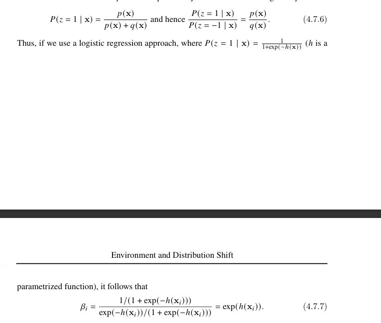

Linear Neural Networks for Classification

Softmax - needed when we need probability destribution.
we use e**x to handle negatives and it also amplifies the differences between numbers.
we normalize values by taking proportional values of total sum of exponential functions.

cross-entropy formula: 

- y (log y hat)

two ways to derive it
1. taking sum of real values multiplied by log of expected value. why log -> it gives spread out spectrum for values input values between 0 and 1 giving higher value for lower inputs and slowly reducing it to 0 as we reach 1. simple case when batch size = 1.

2. maximum likelihood estimation. this is a way of probability where we are combining logs of multiple predicted outputs. see this as way to find loss when batch size > 1.

further intuition development of entropy and cross entropy.

Entropy is quantification of chaos. in this instance, it says how much the probablity is accumulated at one place or how much it is scattered. Ex. [1, 0, 0] has 0 entropy while [1/3,1/3,1/3] has highest entropy as there is no certainty at all.

oj (log oj) would give entropy of single element out of a vector. we do multiplication with oj to give weights to each surprisal. doing sum of of weighted entropis of all elements would give average entropy.

for cross-entropy, we replace multiplication part. we take real probability (coming from labels) to multiply with entropy of predicted probability.

if we add softmax function in cross-entropy formula while getting delta l / delta oj, it beautifully boils down to y hat(j) - y(j). So I suppose this should be the only thing that matters in practical case. Rest seems important to develop math intuition.

- so summarizing this cross-entropy part
- formula is simple however going deeper into where it comes from gives better idea about the math in action.
- 2 ways to see it.
- first, maximum likelihood estimation - we want to maximize the likelihood of label Y when feaure X are given. As they are mutually independent scenarios we do multiplication -> for many multiplication, it would keep going near zero -> so we introduce log. log(ab) = log a + log b. -> log (yi | xi) is y hat j -> multiplying them with y (one-hot encoding) gives cross entropy formula.

- second, entropy and information theory - log value of a predicted probability gives surprisal value of any given prediction. the more it is near 1, we are less suprised. but if an event with 1% chance occurs, we are more surpised. log does exactly that -> multiplying them with their own prediction and summing them up gives us weighted average. multiplication because although some events might have high entropy but it doesn't occur all the time, so multiplying it with its initial prediction value gives its part in total entropy. and that becomes entropy function. -> In the case of classification model where we know real labels and their probability, we can do this multiplication with actual labels and that gives up cross-entropy formula.

-----------------------
some practicals start

Fashion-MNIST dataset classification

- Softmax Regression Implementation from Scratch

below two are new things, rest remains more or less similar.

def softmax(X):
X_exp = torch.exp(X)
partition = X_exp.sum(1, keepdims=True)
return X_exp / partition # The broadcasting mechanism is applied here

def cross_entropy(y_hat, y):
return-torch.log(y_hat[list(range(len(y_hat))), y]).mean()
cross_entropy(y_hat, y)

by combining things we can create classifier for Fashion-MNIST image dataset.
- we flatten input data from 28 x 28 to 784 x 1
- just like linear regression we don't have any hidden layers yet. The new additions however are softmax function to get probability distribution out of predicted numbers and we have cross-entropy loss calculation instead of MSE.
- training and back propagation steps remain same.

- Softmax concise implementation

nn.sequential - we can define layers of process while defining neural network

softmax revisited (interesting one)
LogSumExp

The fundamental knowledge says to
1. get logits
2. find softmax (use of exponential function)
3. put sofmax value of real label into log (use of log function; cross entropy)

use of eponential function is problematic in computers; it can underflow or overflow.

Better approach?
use max(all logit values) - o(J) inside exponential function. mathematically response doesn't change due to rule e**(a-b) = e**a / e**b.

this will save us from overflow. underflow is still a risk

what then?

putting softmax function inside log with use of rule explained above will give LogSumExp formula.
it is a simpler form and safe.

Pytorch internally uses this method.

- Generalization in Classification

summary part re-emphasizes importance of generalization and adds another point.
When we have a complex model (many parameters) with relatively small amount of test data, our initial instinct says it will overfit because model will memorize all train data. However, it is not like that. Although theory says that way, in practice it is au contraire good at generalizing.

So, the point I understood right now is
there are some statistical methods to find generalization beforehand, but it gives pessimistic insights. For example, you will need too many train data.
However, when we do actual training, more often we don't need that many training data.
So, I suppose the chapter will further talk about the industry principles and all.

- 4.6.1 The Test Set

This section addresses ways to predetermine number of test data. Reason? to be confident and aware about our error on any new data that may come in future.
Note that we are not talking about training data. training is already done and we are talking about testing and measuring errors.

First way is with Central Limit Theorem.

It is based on this logic
uncertainty increases proportional to sigma / underroot n ; where sigma is standard deviation and n is number of data.

uncertainty will be percentage of allowed variance (let's say 0.01 aka 1%)
standard deviation will be 0.5 (comes from bernoulli's rule sigma = p(1-p) and p in worst case of uncertainty is 0.5)

if given above 2 values, n will come out as 2500.
It means if around 2500 random set are ran through classifier and recorded deviation from mean error and let's say we put them on a distribution graph, ~68% (1 standard deviation) of cases will obey our 1% variance condition.

If we want to make it happening for 95% of the cases (2 standard deviation), same formula will give n as 10000.

One important relationship out of this is, if we want uncertainty to reduce by half, our dataset size should increase 4 times.

There is another way to take this estimate.
It is using Hoeffding formula. It is a formula that takes bounds of allowed variance (1%) and intended distribution spread to be covered (95%) upfront and gives upper bound of n with surety.

In this case it would give 15000. (It gave 10000 for the same requirement)

The main difference is that central limit theorem assumes that as n increases, the cumulative variance from mean follows a normal distribution.
The Hoeffding formula uses math to directy calculate the value of n without assumption.

4.6.2 Test Set Reuse
It talks about selection of test dataset and how human bias can give us wrong confidence.

Problem 1: If we use same dataset for multiple candidate models, the chance of one model becoming our favorite and another our least favorite becomes high - even when they are not much different in general. Just that this perticular data suited them or unsuited them. To our eyes it may seem logical but it is not. This is the multiple hypothesis testing / aflse discovery problem.

Problem 2: If we do test on a single model, let's say we didn't like the error rate and then moved to another model who operated better on same test set, we used test set as a feedback. which is again not right. We are being biased towards that particular test set. And we are using that test set to influence our model selection which is not right. This is adaptive overfitting problem.

Validation set is available for doing this trial-errors-comparisons but test set should be taken as sacred. touch only at end.

4.6.3 Statistical Learning Theory

this was an intro to this field of maths -statistical learning theory. 
The fact that we can get some concrete conclusion about relationship between model complexity, number of training data and generalization gap purely based on maths is interesting.

concept intro: VC dimension.
VC dimension tells us maximum number of data points a line can divide on euclidian graph in all possible permutations that data points might take both with labels and positions.
For example on a 2d graph, a line can safely separate 3 points with whichever positions they take or binary labels they hold. If the 4th point enters, we can still divide in some cases but not in all cases. so VC dimension for 2d is 3. It is basically 1 + current dimensions.

In ML term it comes into picture when we start taking interest in how much flexible or rigid our model is. For example, we tune number of dimensions as number of training data - 1. We can essentially overfit 100% and once we start reducing number of dimensions or increasing number of training dataset, we start increasing generalization.

This relation is nicely explained in below formula.
It gives certainly that there is some percentage of guarranty that generalization error (difference between emperical error and real world data error) will be limited to some percent.

4.7 Environment and Distribution Shift

A scenario where output of model affects what inputs are received next to classify and how it can be dangerous cycle.

let's say we did all the good things while training and our model has become great at discovering patterns and classifying things. But what if distribution in real world shift? What if we went to some mysterious world where dogs look like cat? Our model is not wrong but the distribution is shifted. The section further talks about this

1. covariate shift - relationships remain same. The type of data we receive change.

p(x, y) = p(x) x p(y | x).

We are saying p(y | x) doesn't change. p(x) change. probability of features changes.

2. label shift - the type of data stays same but the number of times when we encounter them changes.

p(x, y) = p(y) x p(x | y)

p(x | y) remains same. p(y) changes. means when we trained let's say we were getting cancer as label 10% of time but the production data comes with cancer fewer times or more times. Probability of labels changes.

3. concept shift - p(y | x) changes here. 

Possible when geography or times change.
example, a model which classfiies if something is  fashionable. It changes over time so model will not be relevant.

------------
Covariate shift correction

On available training data, loss calculation looks like this

And on all real-world data, loss calculation looks this this (hypothetical); weightage system changes here - we take loss value with proportion to chance of seeing them in real life in general; integral seems to be for infinite amount of data.

Next part introduces beta(i). It says how underrepresented or overrepresented an input is when compared population dataset againt training dataset.
And we use that to give weights in our loss calculation. If an example likely to be encountered more times in real-world, we punish the weights a little more. and vice versa.

How to get beta(i) value is the next question
For that, (it sounds strange and new but) we have to create another simple binary classifier which will classify if a given example is from training data or population data.

Using sigmoid and doing some math will give exp(h(x(i))) as value of beta(i).

h(x) = wx + t; h(x) is basically raw output of our binary classifier.

so what I'm understanding from this is - in p(x,y) = p(x)p(y|x) when p(y|x) is fixed, we can correct covariate shift only by collecting more real-world representative examples (no need of labels); train a second classifier and with that we can better train our primary model.

important catch: if completely new example comes in target dataset, this technic will not work and break something. reason being beta(i) = prod(x)/test(x). if probability of having example in test data is zero or near zero, beta will become too big or even infinity. We don't want that.

Label Shift Correction
Let's say we have no clue about what proportions of labels will look like in real-world (p(y) is unknown and suspicious). So we can use this steps:
1. let's say in training we have 500-500 cats/dogs images.
2. we run it on random real-world images and see that model gives 300 cats / 700 dogs.
    - note that labels are unknown to us, we are using model to get labels
    - we don't really believe if this prediction distribution is correct so we can nudge it with ground truth (which will come from confusion matrix).
3. On 1000 labelled validation data, we can run our classifier and get the accuracy of model.
4. we apply this accuracy rate over production data predictions.
5. Now 300 cats / 700 dogs will be nudge towards true distribution counts. For example, let's say model over or underestimated and after the nudge from confusion matrix, it is 350 cats / 650 dogs. This will be more reliable estimate of real-world labels.
6. we can then get weights by getting population distribution count of cats / training distribution count of cats. ( P(y)/q(y) ) which we can later use in loss function.

Concept Shift Correction
- There is no standard principled way to manage this like we have for the other two.
- We just train on newly updated data on top of existing weights. That's all.
- Examples, old tech products becoming less popular when new products hit market; news stories gradually replaced by new news stories.

4.7.4 A Taxonomy of Learning Problems
This section gives some theory on what a typical trained model will expect in real world and how we might have to rework on it to keep it relevant.
1. Batch Learning - train and deploy, we don't have to come back to it. simple cases. (automatic door example that allows only cats)
2. Online Learning - The labels are not at disposal at beginning. We wait, gather output, compute loss and then have to retrain. (stock price predictor example)
3. Bandits - Online learning but with only a finite set of actions (arms) instead of a continuously parametrized model. Simpler, so stronger optimality guarantees are provable. It is just a special case, not a separate setting.
4. Control - The environment has memory; its response depends on what we did before, but it is not adversarial. (coffee boiler is already warm from the last heating; a user won't read the same news article twice). PID controllers are the standard tool. (Not gone deep into PID)
5. Reinforcement Learning - Environment has memory AND its own agenda - it may cooperate or compete. (chess, other drivers reacting to an autonomous car)

"Considering the Environment - The key variable across all of the above is whether the environment is stationary or adapts to us. A strategy that works on a fixed environment can fail on an adaptive one (an arbitrage opportunity disappears once it is exploited). How fast and how suddenly things change decides the algorithm: slow drift -> force estimates to change slowly; rare sudden jumps -> allow for them explicitly. This is concept shift."

4.7.5 Fairness, Accountability, and Transparency in Machine
Learning
- talks about concerns that may raise due to distribution shifts. Model might become a genius but what if training data were limited and production has lot of new patterns. Also it talks about runaway feedback loops. Predictions make real life decisions and those decision in turn affects future distributions. 